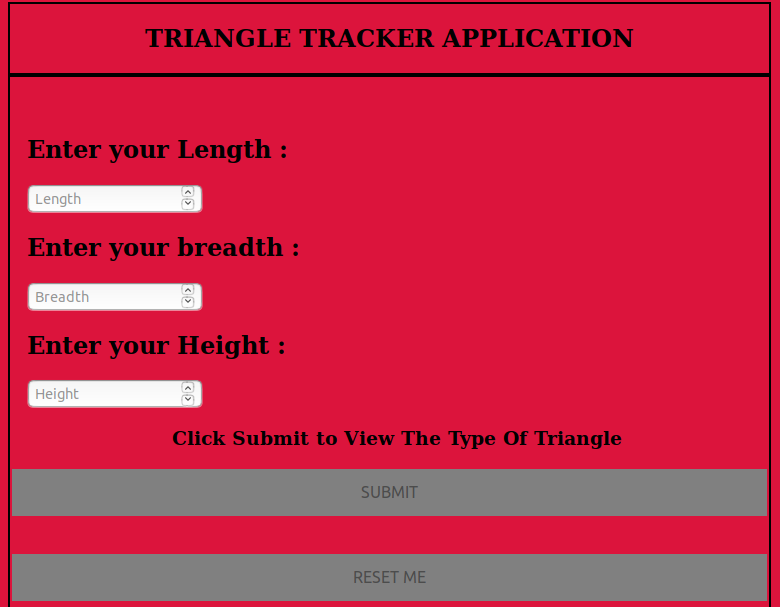
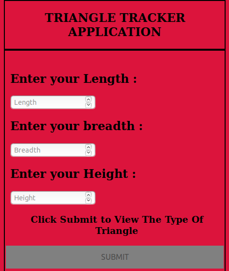
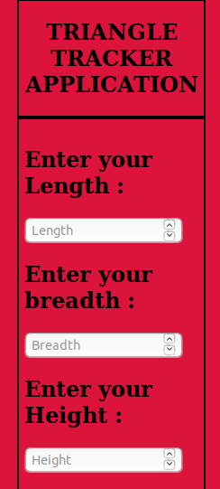

# Triangle-Tracker

#### {This application is used to determine what type of triangle is based on the dimensions supplied by the use}, {30 May 2019}

#### By **{Emmanuel Muchiri}**

##Screenshots
;
;
;

## Description

{This application shows you the type of the triangle based on your inputs.If all your dimensions are equal then it displays an Equilateral Triangle,an isosceles triangle, two sides are exactly equal.For a scalene triangle, none of the sides is equal. However, the sum of any two sides of the triangle must be greater than the third side.Most importantly, if the sum of any two sides of the triangle is equal to or less than the third remaining side, then a triangle CANNOT be formed using those values. (For example, the values 9,4 & 3 cannot form a triangle.)  }

| Syntax      | Description | Test Text     |
| :---        |    :----:   |          ---: |
| Header      | Title       | Here's this   |
| Paragraph   | Text        | And more      |

## Setup/Installation Requirements

-   Connect to the internet
-   Download a web browser of your preference
-   click here to open the link : <https://emmanuelmuchiri.github.io/Triangle-Tracker/>
    ## Known Bugs
    {In case you experience bugs kindly refresh your web page or restart your web browser }
    ## Technologies Used
    { 1 .HTML
      2, CSS }
    ## Support and contact details
    {Contact me on my Telephone Number : +254706915605.}
    ### License
    MIT License
    Copyright (c) {2019}
